# HappyHouse

- 공공API를 활용한 **부동산 거래 정보 제공**과 함께 관련 서비스 제공
- **회원 관리** 및 전용 서비스를 위한 기능, **아파트 거래 정보** 제공, **관심 매물 관리**를 기본으로 한 통합 웹 서비스
- 기본 기능을 바탕으로 한 QnA 및 공지사항 게시판 운영, 채널 톡 서비스 연계하여 사용자 친화 UX/UI로 **사용자 중점**

# 기능 아키텍쳐 구성
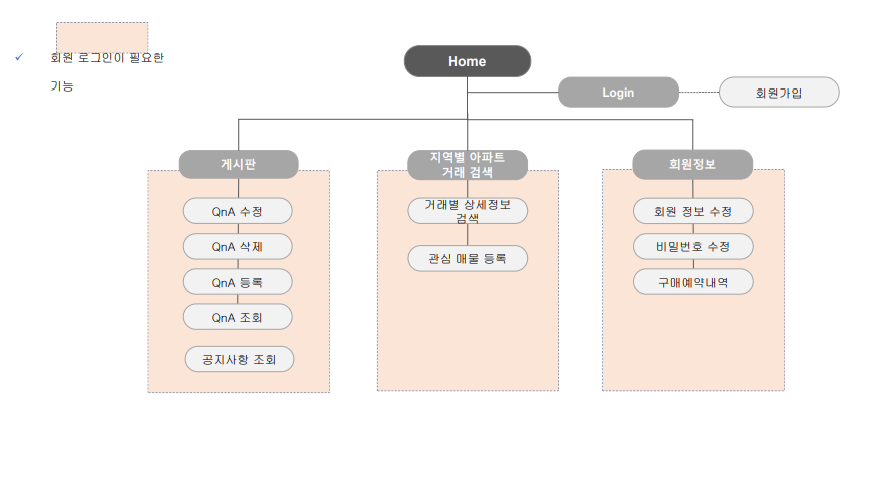

# 실행화면

### ▶️ 메인페이지

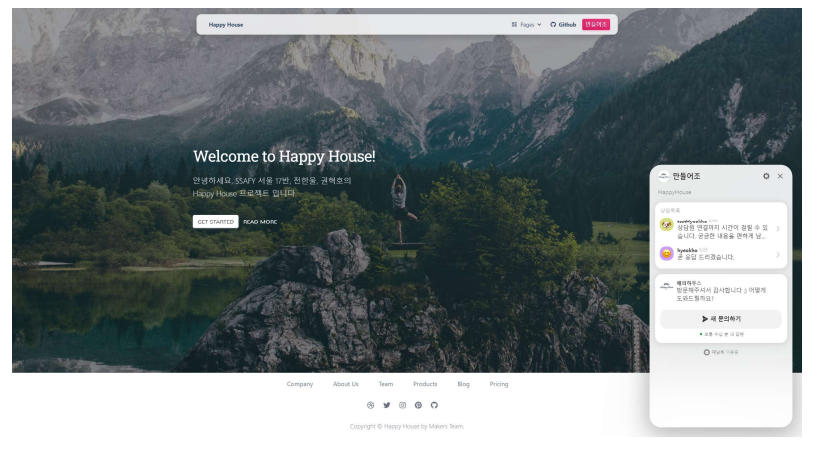

### ▶️ 메인페이지 - NavBar

- 회원과 비회원의 서비스 이용 범위 차별화
- 로그인 여부 확인을 통해 사용자 편의성 개선

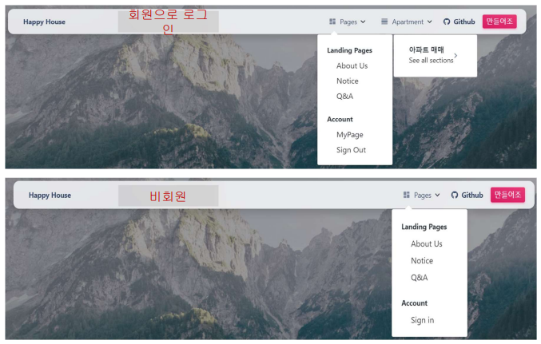

### ▶️ 로그인

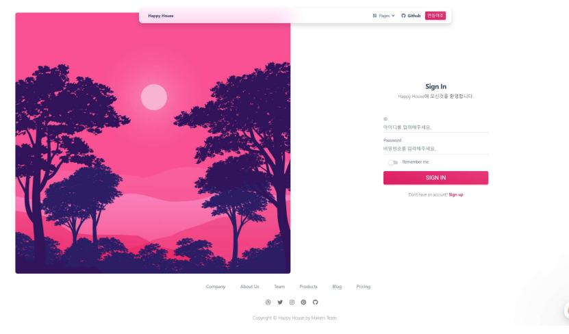

### ▶️ 회원가입

- 프론트 엔드 → 공백처리와 같은 유효성 처리
- 백 엔드 → 중복 처리와 같은 유효성 처리
    
    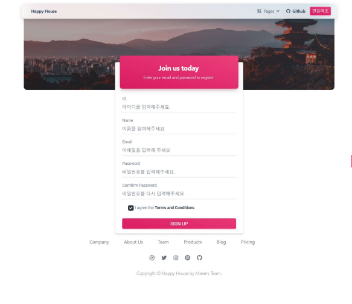
    

### ▶️ 회원 정보 수정 및 삭제

- 알림창을 활용한 회원 탈퇴
- 회원 정보 수정 시 아이디 수정 X

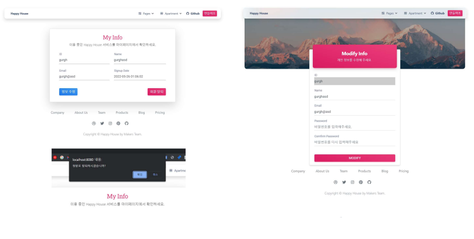

### ▶️ 아파트 거래 정보

- 공공데이터 API를 활용한 아파트 거래 정보 조회
- 카카오 맵 API를 활용한 지도 표시
- 관심 지역 선택 가능

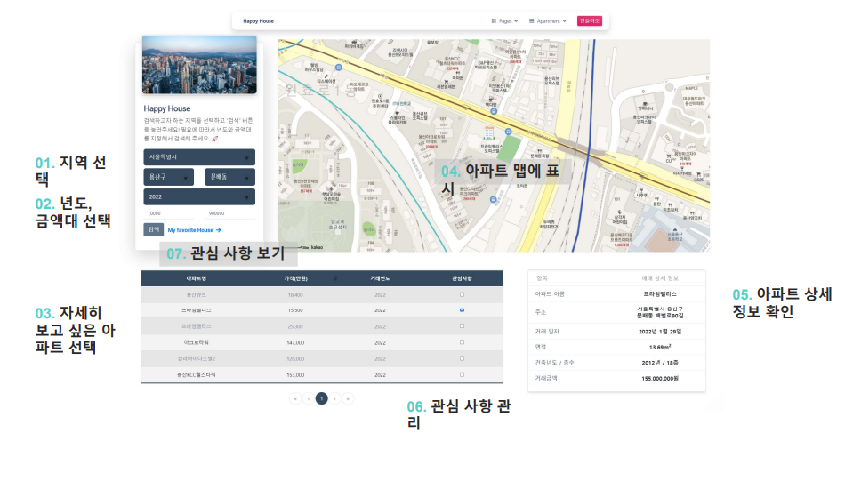

- ▶️ **공공데이터를 통한 시 조회**

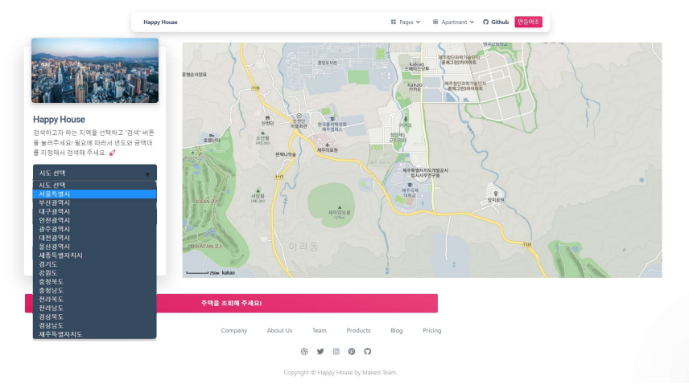

- ▶️ **공공데이터를 통한 군,구 조회**

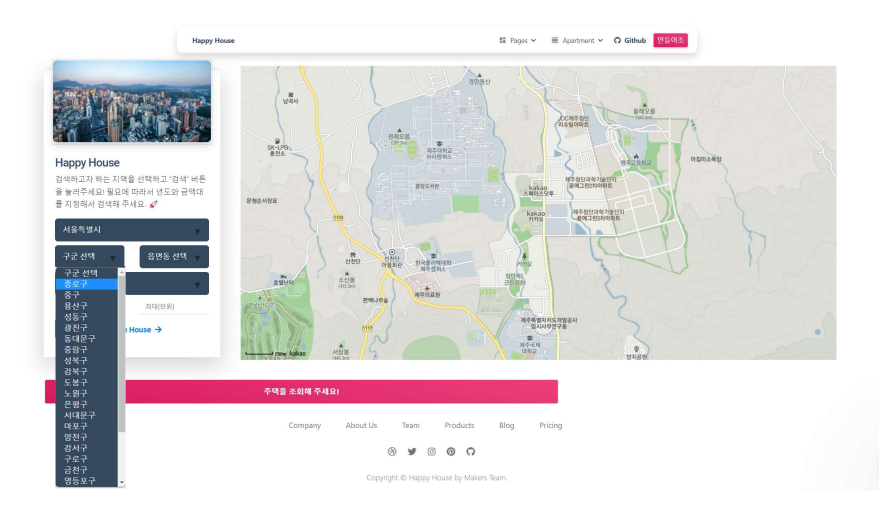

- ▶️ **공공데이터를 통한 동 조회**

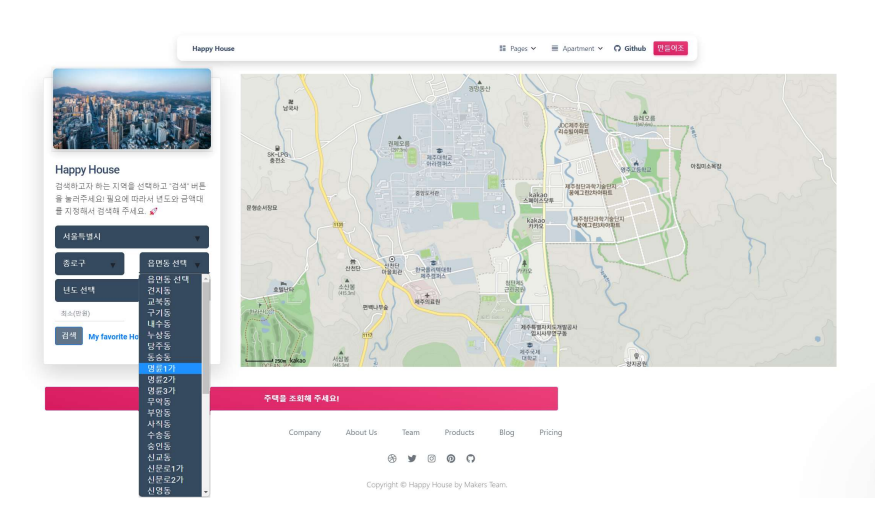

- ▶️ **아파트 거래 조회**
    
    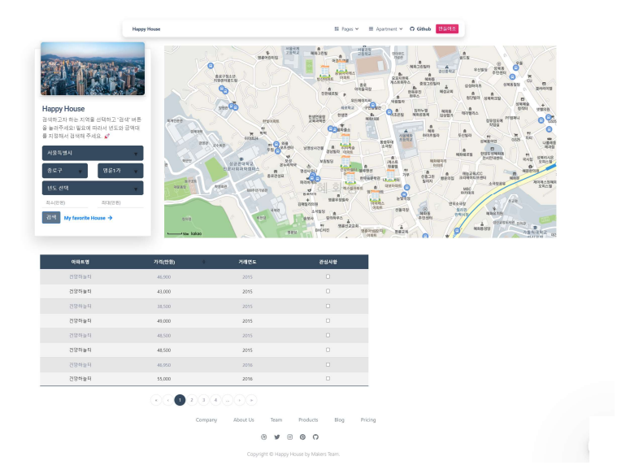
    
- ▶️ **아파트 거래 상세 정보 조회**
    
    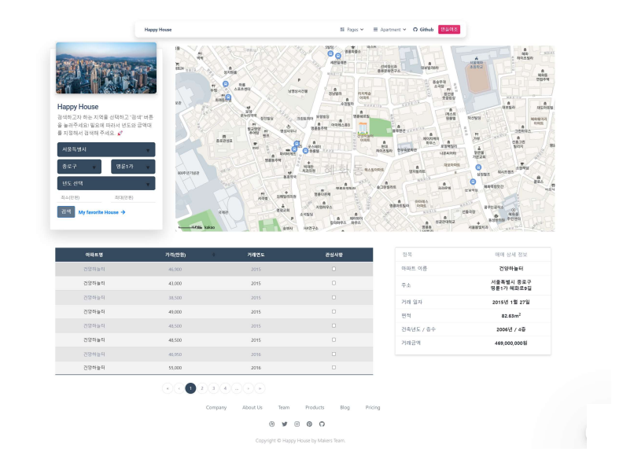
    

### ▶️ 공지사항

- Hide & Show 방식의 공지사항 보기

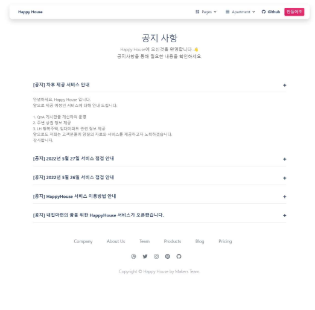

### ▶️ Q&A

- Pagination 방식의 게시글 모아보기

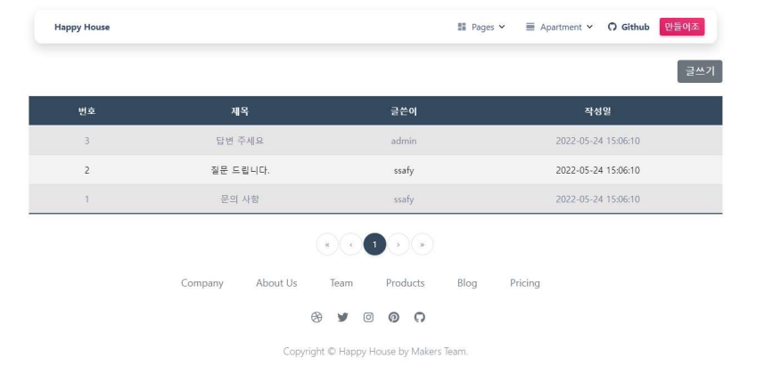

### ▶️ Q&A 상세보기

- 게시글 상세보기
- 게시글 수정 및 삭제 가능

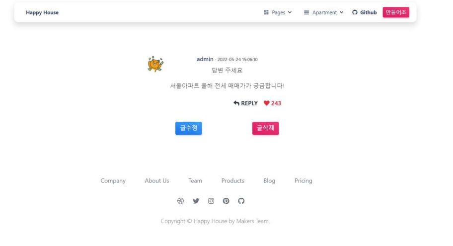

### ▶️ Q&A 등록

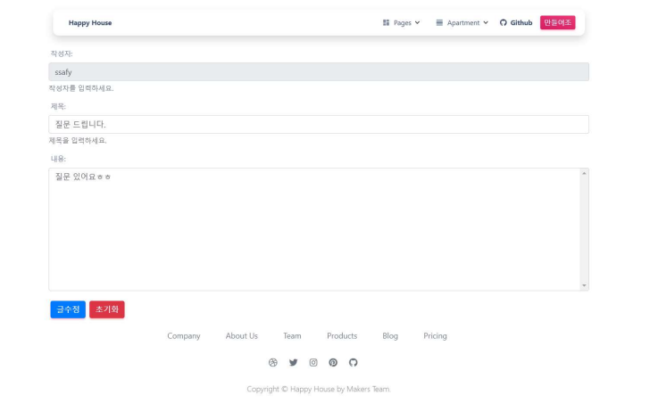

### ▶️ 관심지역

- 관심 지역 설정을 통해 특정 매물과 관련된 정보를 빠르게 확인 가능

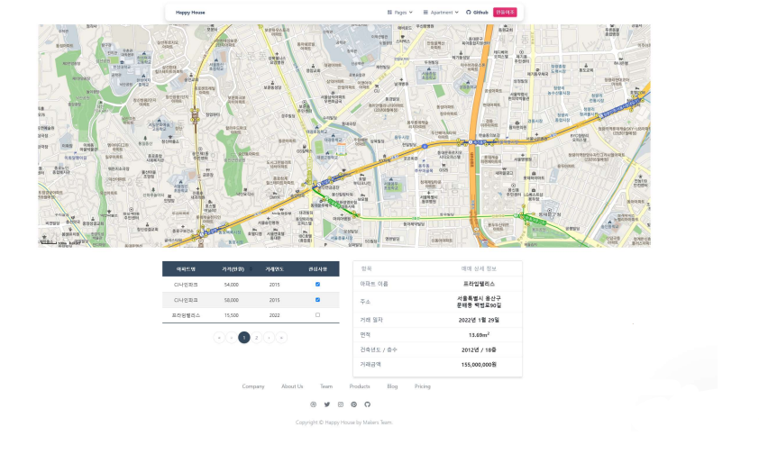
